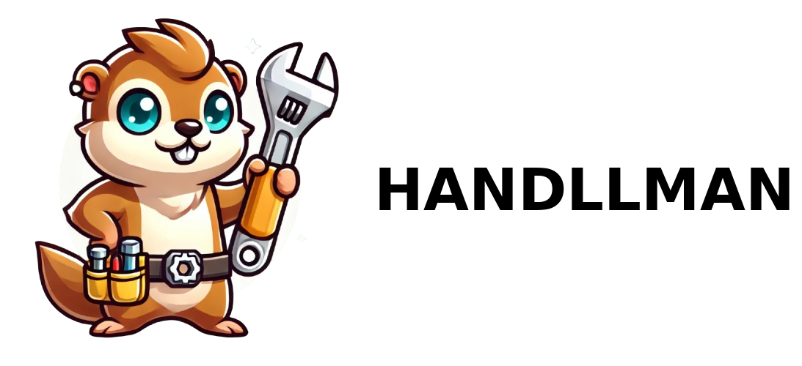

The best Tool when you need shitty advice for a buddy that has no idea how to fix your machines. 
Written in go!

## Abstract
1. Have go based api that talks to gemini and gives you the ability to communicate with and bot. (Backend)
2. Whatever (Frontend)
3. Postgresql with pgVector that stores manuals of machiens that you own in an vector database (mounted via `/local/manuals:/pg/manuals` or whatever)
4. Endpoint to upload manuals
5. (If im feeling super fancy) WebSearch for the manual given the name of the machine or asking the user question about which year how money buckz they spended on it blaa to determine which machine it could be
6. Giving Advice what could be broken
7. Giving Advice how it could be fixed also maybe a shopping list of what we need to fix it

## What's the point of this project?
- I want to do go 
- I suck at fixing stuff
- Reading manuals is lame
- Handymans are expensive